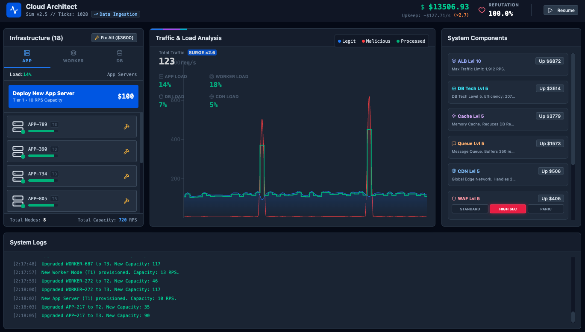

# Cloud Infrastructure Simulator

A real-time infrastructure management simulator where you design, scale, and defend a cloud system under dynamic traffic, unpredictable workloads, and security threats.

Your mission: maintain high reputation, ensure profitability, and prevent system failure as demand continuously grows.

---

## Preview



---

## Core Gameplay Loop

Every second (a “tick”), the system simulates:

- Traffic Generation → Growth + randomness  
- Traffic Patterns → Normal / Shopping Surge / Data Ingestion / Viral Spike  
- Random Events & Attacks → DDoS, hardware failures, funding boosts, outages  
- Request Routing Pipeline → ALB → WAF → CDN → App / Worker / DB  
- Performance Metrics → Throughput, dropped requests, node health  
- Economics Update → Revenue vs upkeep, reputation changes  

You must make strategic decisions in real time to balance performance, cost, and security.

---

## Infrastructure Management

### Nodes (Horizontal Scaling)

Deploy and upgrade compute units across three layers:

- APP Nodes → Handle general user requests  
- WORKER Nodes → Process heavy operations (uploads, async tasks)  
- DB Nodes → Manage storage, queries, and indexing (critical and costly)  

Each node includes:

- Tier Levels → T1 → T2 → T3 (higher power, higher cost)  
- Health System → Degrades under overload, may crash, requires recovery  

---

### Platform Components (Vertical Scaling)

Upgrade core infrastructure services:

- ALB (Automatic Load Balancer)  
  - Sets maximum incoming traffic capacity  
  - Primary bottleneck if underpowered  

- WAF (Web Application Firewall)  
  - Filters malicious traffic  
  - Can overload under extreme attack  

- CDN (Content Delivery Network)  
  - Offloads static content  
  - Overflow shifts load to app servers  

- DB Technology Upgrade  
  - Improves database efficiency (multipliers)  

- Cache (Redis)  
  - Reduces DB load (especially reads and search)  

- Queue (SQS)  
  - Buffers spikes in write-heavy workloads  

---

## Operations (Active Abilities)

Temporary boosts with cooldowns:

- Flush CDN Cache → Short-term CDN performance boost  
- Optimize Indexes → Improves DB efficiency temporarily  
- Live Security Patch → Enhances WAF performance  

---

## Security Modes

Adjust firewall behavior based on threat level:

- Standard Mode  
  - Balanced filtering  
  - No false positives  

- High Security Mode  
  - Stronger protection  
  - Minor legitimate traffic loss  

- Panic Mode  
  - Maximum blocking  
  - High false positives  

---

## Failure Conditions

There is no fixed “win” — survival is the goal.

You lose when:

- Reputation reaches 0%  
- Budget drops below bankruptcy threshold  

---

## Strategy Tips

- Upgrade ALB early — it is a hard traffic cap  
- Monitor bottlenecks — especially the database  
- Use Cache and DB Tech for read-heavy workloads  
- Use Queue and Workers for write-heavy bursts  
- Avoid sustained overload — it accelerates failures  

---

## Tech Stack

- React 19 with TypeScript  
- Vite  
- Tailwind CSS v4  
- Recharts for visualization  
- Lucide for icons  

---

## Getting Started

### Install dependencies (using Bun)

```bash
bun install
bun run dev